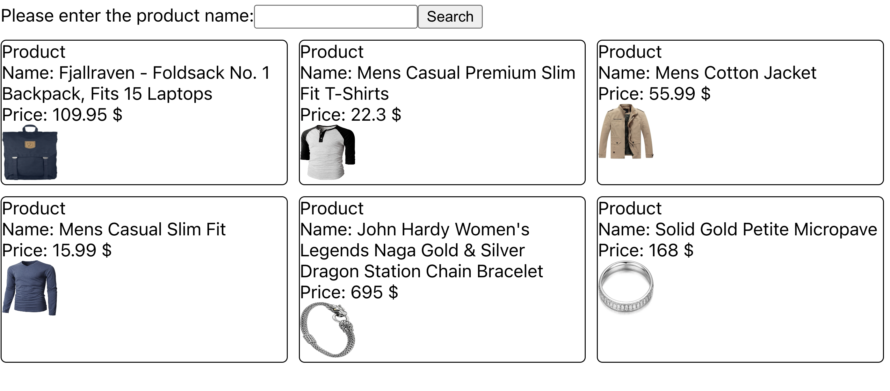
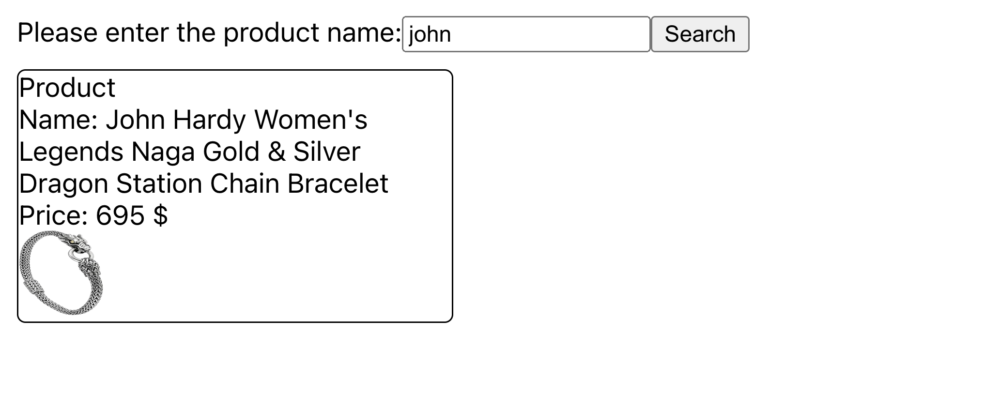

# React hook - useState

## How to run project

1. Step 1: yarn
2. Step 2: yarn start

## Requirements

1. Form
   get data from a from use `onChange`

2. Search

- get user input from a form in `UserInput` component
- display data in `ProductList` then product detail in `ProductItem`
- search product base on what user typing ans show result on the screen

## Hints

- The second assignment: ALL THE DATA SHOULD BE IN APP
- Logic to search data also in app

## Screenshot

